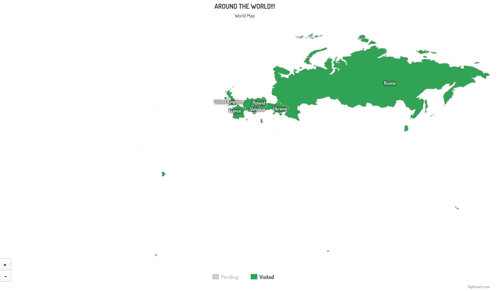
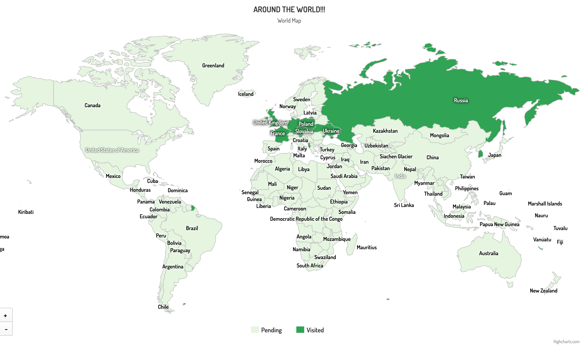
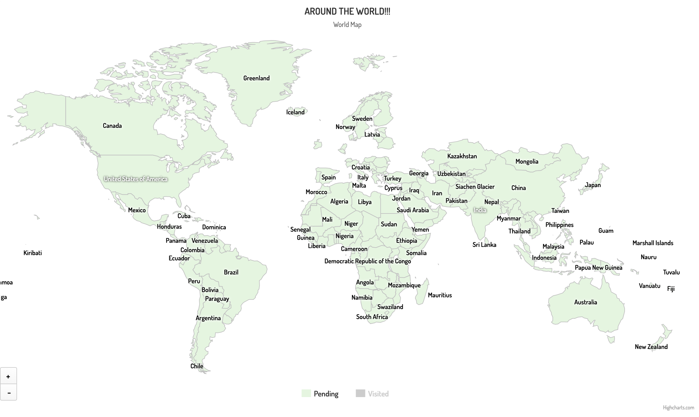

# 🌍 Around The World

A lightweight, static web app that visualizes visited vs. pending places on an interactive **Highcharts Highmaps** world map, with drilldown support for individual countries.

**[▶ Live demo](https://a-dubaj.github.io/Around_The_World/)**



---

## Features

- Interactive world map with pan/zoom controls and hover highlighting
- Two status categories: **Visited** and **Pending**
- Drilldown maps:
  - `us` → US states
  - `in` → India states/UTs (disputed-territories variant)
- Simple customization via a single data file — no need to touch rendering logic

## Preview

| First look                           | Visited                        | Pending                        |
| ------------------------------------ | ------------------------------ | ------------------------------ |
|  |  |  |

## Tech Stack

- HTML + JavaScript, jQuery
- [Highcharts Highmaps](https://www.highcharts.com/maps/) (vendored locally under `js/lib/`)
- Map datasets:
  - `custom/world`
  - `countries/us/us-all`
  - `countries/in/custom/in-all-disputed`

> **Note:** Highcharts is free for personal/non-commercial use only. If you fork this project for commercial purposes, you'll need a [Highcharts license](https://www.highcharts.com/license).

## Getting Started

### Run with Docker / Podman

```bash
# Build
docker build -t around-the-world:latest .

# Run
docker run --rm -p 8080:80 --name around-the-world around-the-world:latest
```

```bash
# Podman equivalent
podman build -t around-the-world:latest .
podman run --rm -p 8080:80 --name around-the-world around-the-world:latest
```

Then open **http://localhost:8080**.

### Run locally without Docker

```bash
npm install
npx http-server .   # or any static file server
```

## Customization

All visited/pending data lives in one place — no need to edit rendering code.

```js
// js/data.js
export const visitedCountries = ['pl', 'de', 'fr', 'gb'];
export const visitedStatesInUS = ['us-ca', 'us-ny'];
export const visitedStatesInIndia = ['in-ka', 'in-mh'];
```

> **Important:** entries must match the Highcharts `hc-key` values from the corresponding map dataset (see Troubleshooting below on how to check this in the console).

## Testing

```bash
npm test
```

Tests live under `tests/` and run via Jest + Babel.

## Troubleshooting

**Blank map / missing shapes**

- Confirm the script paths in `index.html` match your repository layout.
- Open DevTools → Console/Network to spot 404s for `world.js`, `us-all.js`, or the India dataset.

**Drilldown does nothing**

- Confirm the datasets are actually loaded:
  ```js
  Highcharts.maps['countries/us/us-all'];
  Highcharts.maps['countries/in/custom/in-all-disputed'];
  ```
- Confirm the `hc-key` values in your data file match the dataset's keys exactly.
